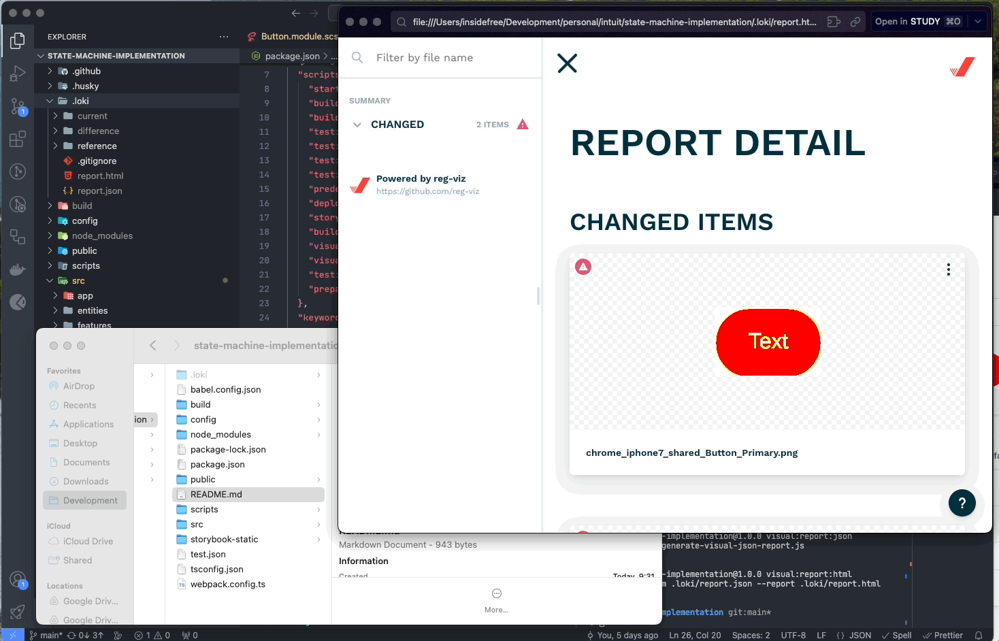

# state-machine-implementation

A ReactJS web page for state-machine-lib implementation [DEMO](https://densorokin.github.io/state-machine-implementation/)

## What was done
- [x] Configured React project
- [x] Added lazy loading for each link in Navbar
- [x] Used [FSD (Feature Sliced Design) patter](https://feature-sliced.design/)
- [x] Added unit tests
- [x] Added screenshot tests
- [x] Added screenshot tests report viewer
- [x] Added Storybook
- [x] Added pre-commit mechanism
- [x] Added github action
- [ ] WIP: needs to fix Nginx for getting stateMachineConfiguration file from custom server

## How to use it?

You can use the project in this way:

### Install
```bash
# with npm
npm install
```

### Run the project
```bash
# with npm
npm start
```

### Run unit tests
```bash
# with npm
npm run test:unit
```

### Run screenshot tests
```bash
# with npm
npm run storybook
npm run test:ui
npm run test:ui:report
```
open the file: ./.loki/report.html



### Run deploy 
```bash
# with npm
npm run deploy
```
